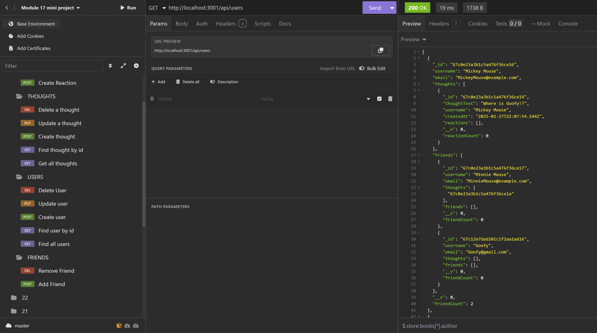

# Kyle's Social Network API Application

## Description 
📝 
This application allows a user to share their thoughts, react to friends thoughts, and create a friend list on the backend. Testing will be done in Insomnia and the database utilization is through MongoDB. Express.js will execute the routing.

## Demo Link
📽️- [Demo Link of Application](https://drive.google.com/file/d/1QJA6X0Rrp4FWcrizm5lPNhT06Y-7daO3/view) - 14 minutes  

---

## 🎨 **Mock-Up**

---

## Table of Contents 📋 
- [Installation](#installation)
- [Usage](#usage)
- [License](#license)
- [Contributing](#contributing)
- [Tests](#tests)
- [Questions](#questions)

## Installation
💽 
First, Download the required dependencies, dotenv, express, and mongoose. Once the dependencies are installed on the package.json, then you will need to run the terminal commands.  
As follows the terminal commands are npm install, npm run build, and lastly npm run dev. This is for local execution. A demo link is provided above since this application is not deployed on a third party source. 

## Usage
🖱️ 
This application's usage is demonstrated in the demo link as it will not be deployed for viewing. This is because the application is for the backend, there is no frontend visual which is why a demo link with Insomnia is provided. 

## License
This project is licensed under the [MIT License](https://opensource.org/licenses/MIT).

## Contributing
✍️ 
Any developer can contribute under the MIT license. 

## Tests
🖥️ 
You may test the application by executing the integrated terminal command, "npm run dev" or "npm run start". From there, experiement with the different urls in insomnia with the id tags for users, thoughts, reactions, and friends to execute proper GET, POST, PUT, 

## Questions
❓ 
For additional questions, reach out to me via:
- GitHub: [KyBrMar12](https://github.com/KyBrMar12)
- Email: KyBrMar@gmail.com
